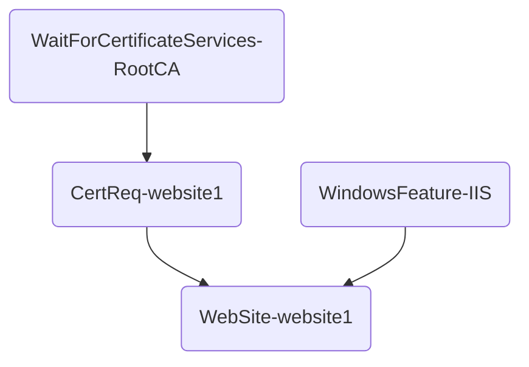

# DSC Dependency Graph

## New-MofMermaid

This script generates a Mermaid MarkDown template containing a flowchart of DSC
resources with links to their dependencies. The script requires a DSC MOF file
generated by a DSC configuration. For example the MOF file generated by
[DemoConfiguration](DemoConfiguration.ps1):




With a tool like [mermaid-cli](https://github.com/mermaid-js/mermaid-cli) the
generated template can be used to generate a MarkDown file or a graphic file
like PNG or SVG. The above template will be generated as the following PNG:


### Install

Download the ps1 file and unblock it. Then dot source it to make it available
in your session. For example:

```powershell
. .\New-MofMermaid.sp1
Get-Help New-MofMermaid -detailed
```

### Tutorial

Dot source the DemoConfiguration and generate a MOF file:

```powershell
. .\DemoConfiguration.ps1
DemoConfiguration
New-MofMermaid -MOFFile .\DemoConfiguration\localhost.mof |
  Out-File .\DemoConfiguration\DemoConfiguration.mmd
```

The above script:

1. dot sources DemoConfiguration
2. generates a .\DemoConfiguration\localhost.mof file
3. generates a DemoConfiguration.mmd file

The generated mmd file can be included into a MarkDown file.

To generate a MarkDown file, install [mermaid-cli](https://github.com/mermaid-js/mermaid-cli)
and execute:

```powershell
& mmdc -i .\DemoConfiguration\DemoConfiguration.mmd -o .\DemoConfiguration\DemoConfiguration.md
```

To generate an image, execute:

```powershell
& mmdc -i .\DemoConfiguration\DemoConfiguration.mmd -o .\DemoConfiguration\DemoConfiguration.png
```

If the DSC configuration is complex or just huge, the picture quality might not be
the best due to the default image size of mmdc. Either use SVG or set with and
hight on the command line:

```powershell
& mmdc -i .\DemoConfiguration\DemoConfiguration.mmd -o .\DemoConfiguration\DemoConfiguration.png -w 100000 -H 1000
```

The image size looks overated but the real image size will probably be smaller,
depending on the number of resources.

